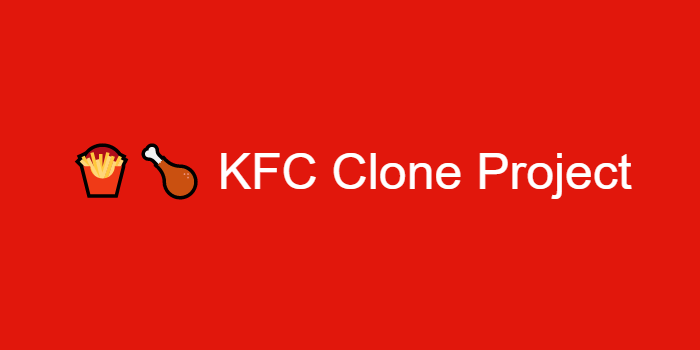

# RestaurantCloneKFC

## A simple website clone using HTML, CSS & JS

This will help build the foundations of good practice, proper experimenting and learning.

### MY FIRST STEPS IN CREATING A WEBSITE:

#### 1. VISUALIZE THE DESIGN LAYOUT

Most foundations include: 

* Background/Body
* Container
* Header
* Main Content
* Footer
